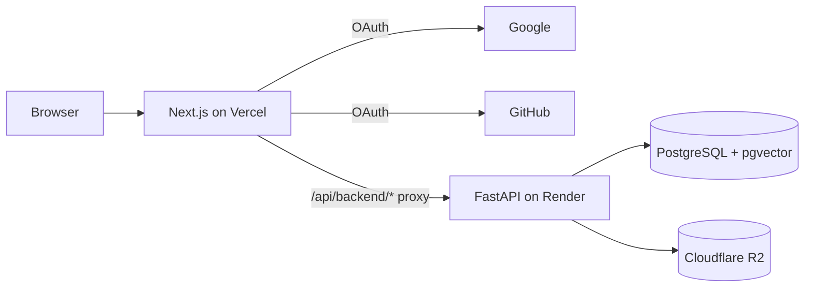

# MultiFileRAG — Architecture (Phase 1)

> Living document for the pilot implementation. Update when phases 2–4 add subsystems.

**Last updated:** 2026-06-13 · **Phase:** 1 (Foundation)

---

## 1. System overview

MultiFileRAG is a monorepo with a **Next.js frontend** (Vercel) and **FastAPI backend** (Render). User files live in **Cloudflare R2** (MinIO locally). Metadata lives in **PostgreSQL** (Neon locally via Docker).



| Layer | Technology | Host (prod) | Host (local) |
|-------|------------|-------------|--------------|
| Frontend | Next.js 14, Auth.js, Tailwind | Vercel Hobby | `localhost:3000` |
| Backend | FastAPI, SQLAlchemy, Alembic | Render Free | `localhost:8000` |
| Database | PostgreSQL 16 + pgvector | Neon Free | Docker Postgres |
| Object storage | S3 API (boto3) | Cloudflare R2 | MinIO |
| Shared config | JSON + TS constants | — | `packages/shared/` |

---

## 2. Repository layout

```
MultiFileRAG/
├── apps/
│   ├── web/                    # Next.js frontend
│   │   ├── app/                # App Router pages
│   │   ├── components/         # UI components
│   │   ├── lib/                # API client
│   │   └── auth.ts             # Auth.js config
│   └── api/                    # FastAPI backend
│       ├── app/
│       │   ├── main.py         # App entry + CORS
│       │   ├── auth.py         # JWT + sync types
│       │   ├── deps.py         # Auth dependencies
│       │   ├── models/         # SQLAlchemy models
│       │   ├── routers/        # HTTP routes
│       │   ├── services/       # Storage (R2/MinIO)
│       │   └── constants/      # Extension allowlist (reads shared JSON)
│       ├── alembic/            # DB migrations
│       └── tests/              # pytest suite
├── packages/shared/            # Cross-app constants
│   ├── supported_extensions.json
│   └── constants.ts
├── docker/docker-compose.yml   # Postgres + MinIO
└── docs/                       # PRD, plans, this file
```

---

## 3. Authentication flow

1. User clicks **Continue with Google/GitHub** on `/login`.
2. Auth.js completes OAuth on Vercel (`/api/auth/*`).
3. On first token issue, Auth.js **server callback** calls `POST /v1/auth/sync` on FastAPI with `X-API-Key: API_AUTH_SECRET`.
4. FastAPI upserts `users` row (unique on `oauth_provider` + `oauth_subject` — **separate accounts per provider**).
5. FastAPI returns a signed **JWT** (`API_AUTH_SECRET`, 7-day expiry).
6. JWT is stored in Auth.js session as `accessToken`.
7. Browser calls `/api/backend/v1/*` (proxied to FastAPI) with `Authorization: Bearer <token>`.

**Protected routes:** `/files`, `/chat` (middleware redirects to `/login`).

---

## 4. File upload flow (Phase 1)

1. Client validates extension/size (optional pre-check) then `POST /v1/files` with multipart body.
2. API validates against `packages/shared/supported_extensions.json` (15 MB/file, 100 MB/account).
3. Row created with status `uploading`; blob written to R2/MinIO at `{user_id}/{file_id}/{filename}`.
4. Status set to **`processing`** (Phase 2 ingestion will set `ready` or `failed`).
5. `GET /v1/files` returns list + storage summary.
6. `DELETE` removes R2 object + DB row. `PUT` replaces blob and resets status to `processing`.

**Never store files on Render disk** — ephemeral and lost on redeploy.

---

## 5. API surface (Phase 1)

| Method | Path | Auth | Purpose |
|--------|------|------|---------|
| GET | `/health` | None | Render health check |
| POST | `/v1/auth/sync` | `X-API-Key` | Upsert user (server-to-server) |
| GET | `/v1/files` | Bearer JWT | List files + storage |
| POST | `/v1/files` | Bearer JWT | Upload |
| DELETE | `/v1/files/{id}` | Bearer JWT | Delete |
| PUT | `/v1/files/{id}` | Bearer JWT | Replace |

Phase 3+ endpoints (conversations, query SSE, preferences) are defined in [TECHNICAL_PLAN.md](./TECHNICAL_PLAN.md) §8 but not implemented yet.

---

## 6. Data model (Phase 1)

### `users`

| Column | Type | Notes |
|--------|------|-------|
| id | UUID PK | Internal user id |
| oauth_provider | string | `google` or `github` |
| oauth_subject | string | Provider account id |
| email | string? | From OAuth profile |
| citations_enabled | bool | Default `true` (wired in Phase 3) |
| created_at | timestamptz | |

Unique: `(oauth_provider, oauth_subject)`

### `files`

| Column | Type | Notes |
|--------|------|-------|
| id | UUID PK | |
| user_id | UUID FK | Cascade delete |
| filename | string | Original name |
| extension | string | Lowercase, no dot |
| size_bytes | bigint | |
| status | enum | `uploading`, `processing`, `ready`, `failed` |
| storage_path | string | R2 key |
| error_message | text? | Set on failure (Phase 2) |
| created_at | timestamptz | |

---

## 7. Environment variables

See [.env.example](../.env.example) and [TECHNICAL_PLAN.md](./TECHNICAL_PLAN.md) §11.

| Variable | Where | Purpose |
|----------|-------|---------|
| `DATABASE_URL` | API | Postgres connection |
| `API_AUTH_SECRET` | API + Web | JWT signing + sync auth |
| `AUTH_SECRET` | Web | Auth.js session encryption |
| `GOOGLE_*`, `GITHUB_*` | Web | OAuth |
| `API_URL` | Web | FastAPI URL for rewrites + sync |
| `S3_*`, `R2_ACCOUNT_ID` | API | Object storage |
| `CORS_ORIGINS` | API | Allowed frontend origins |

---

## 8. Deployment

### Render (API)

- Root directory: `apps/api`
- Build: `pip install -r requirements.txt`
- Start: `uvicorn app.main:app --host 0.0.0.0 --port $PORT`
- Health: `GET /health`
- Run migrations: `alembic upgrade head` (once per deploy or in build step)

### Vercel (Web)

- Root directory: `apps/web`
- Set `API_URL` to Render service URL
- Add production OAuth redirect URIs

---

## 9. Local development

```bash
# 1. Infrastructure
cd docker && docker compose up -d

# 2. API
cd apps/api
python -m venv .venv && source .venv/bin/activate
pip install -r requirements.txt
cp ../../.env.example .env   # adjust as needed
alembic upgrade head
uvicorn app.main:app --reload --port 8000

# 3. Web
cd apps/web
npm install
cp ../../.env.example .env.local   # set OAuth + secrets
npm run dev
```

Verify: `curl http://localhost:3000/api/backend/health` → `{"status":"ok"}`

---

## 10. Phase roadmap

| Phase | Adds | Status |
|-------|------|--------|
| **1** | Auth, upload, Files UI, deploy configs | **Current** |
| 2 | Parsing, chunking, embeddings, Ready/Failed | Planned |
| 3 | RAG Q&A, conversations, citations UI | Planned |
| 4 | Polish | Planned |

---

## 11. Revision history

| Date | Change |
|------|--------|
| 2026-06-13 | Initial Phase 1 architecture document |
