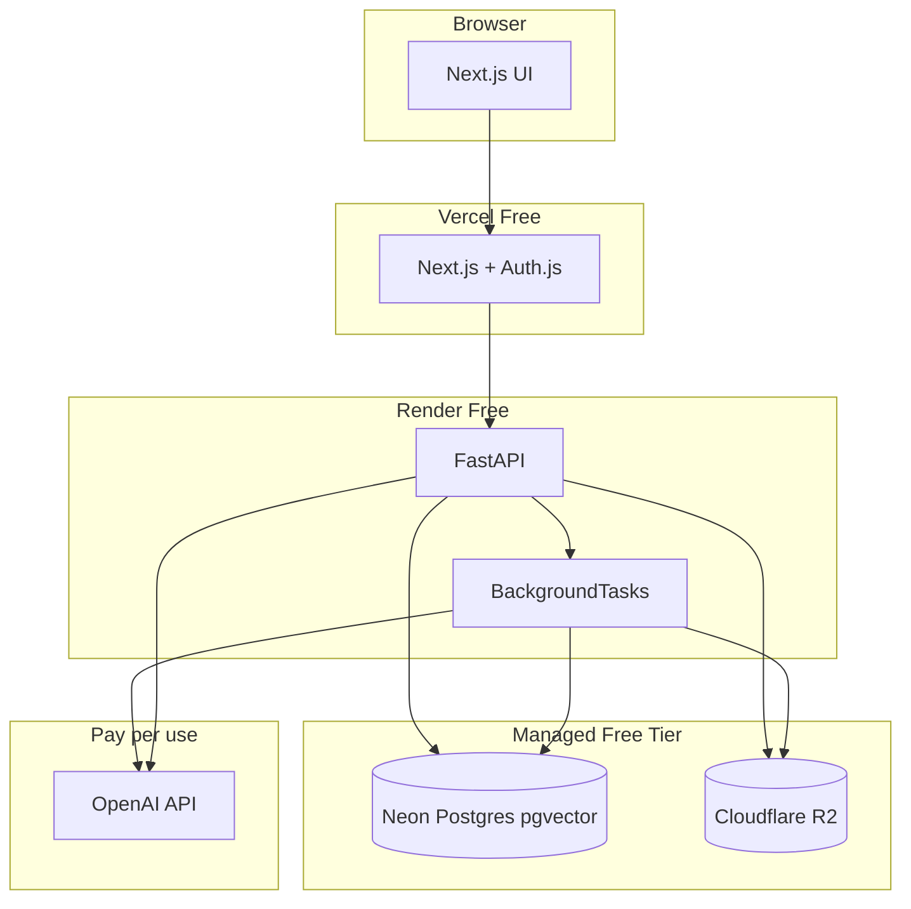

# MultiFileRAG — Technical Plan

| Field | Value |
|-------|-------|
| **Document Version** | 1.0 |
| **Status** | **Approved** — ready for Phase 1 implementation |
| **Last Updated** | 2026-06-13 |
| **Related Documents** | [PRD](./PRD.md), [Features](./FEATURES.md), [Phase 1 Plan](./plans/implementation-phase-1.md) |

---

## 1. Purpose

This document defines the approved technical architecture for MultiFileRAG v1, optimized for a **study/pilot project** with **$0 hosting** where possible. Variable cost is limited mainly to **OpenAI API usage**.

---

## 2. Approved Decisions Summary

| ID | Decision | Approved value |
|----|----------|----------------|
| T-01 | Stack | Next.js + FastAPI + PostgreSQL/pgvector (see §5) |
| T-02 | LLM | OpenAI **GPT-4o-mini** |
| T-03 | Embeddings | OpenAI **text-embedding-3-small** |
| T-04 | Deployment | **Free-tier cloud** (see §5.3) |
| T-05 | Deployment model | **Public pilot** on free tiers; local dev via Docker |
| T-06 | OAuth account linking | **Separate accounts** per provider |
| T-07 | Citation excerpt length | **~200 characters** |
| T-08 | Chunking | **800 tokens**, **100 token overlap** |
| T-09 | HTTPS / encryption | Required in production (provided by hosts) |
| T-10 | Latency target | Best effort on free tier; no SLA for pilot |

**Architecture:** Monolith API + background ingestion (Option A).

---

## 3. Free / Cheapest Hosting Strategy (Pilot)

### 3.1 Cost model

| Category | Service | Tier | Monthly cost |
|----------|---------|------|--------------|
| Frontend | [Vercel](https://vercel.com) | Hobby | **$0** |
| Backend API | [Render](https://render.com) | Free web service | **$0** |
| Database | [Neon](https://neon.tech) | Free (pgvector) | **$0** |
| Job queue | FastAPI `BackgroundTasks` (Phase 1–2) | In-process | **$0** |
| File blobs | [Cloudflare R2](https://developers.cloudflare.com/r2/) | Free tier | **$0** |
| Redis (optional) | [Upstash](https://upstash.com) | Free | **$0** — defer until needed |
| LLM + embeddings | OpenAI API | Pay-as-you-go | **~$1–5** typical study use |

**Total hosting: $0/month.** Only OpenAI API usage is paid (pennies per query with gpt-4o-mini).

### 3.2 Approved deployment topology

```
┌─────────────┐     HTTPS      ┌──────────────────┐
│   Vercel    │ ──────────────►│  Render (Free)   │
│  Next.js    │   API + SSE    │  FastAPI         │
│  Auth.js    │◄──────────────►│  BackgroundTasks │
└─────────────┘                └────────┬─────────┘
                                        │
                    ┌───────────────────┼───────────────────┐
                    ▼                   ▼                   ▼
              ┌──────────┐      ┌────────────┐      ┌─────────────┐
              │   Neon   │      │ Cloudflare │      │   OpenAI    │
              │ Postgres │      │     R2     │      │  API        │
              │ pgvector │      │ raw files  │      │ LLM+embed   │
              └──────────┘      └────────────┘      └─────────────┘
```

### 3.3 Free-tier limitations (acceptable for pilot)

| Limitation | Impact | Mitigation |
|------------|--------|------------|
| Render free **spins down** after ~15 min idle | Cold start ~30–60s | Accept for study; upgrade to Render $7/mo if needed |
| Neon free **0.5 GB** DB | Enough for vectors at pilot scale | Monitor; 100 MB/user file cap helps |
| R2 free **10 GB** storage | Plenty for pilot users | — |
| Vercel serverless timeouts | SSE must proxy to Render, not Vercel | Stream from FastAPI on Render |
| OpenAI requires credit card | Small API spend | Set billing hard limit in OpenAI dashboard |

### 3.4 Local development ($0)

```bash
docker compose up   # Postgres+pgvector, MinIO (R2-compatible), optional Redis
npm run dev         # Next.js → localhost:3000
uvicorn app.main    # FastAPI → localhost:8000
```

Use `.env.local` for OAuth and OpenAI keys. Same code paths as production.

### 3.5 Upgrade path (if pilot outgrows free tier)

| When | Upgrade | ~Cost |
|------|---------|-------|
| Cold starts annoying | Render Starter | $7/mo |
| DB full | Neon Launch | ~$19/mo |
| Heavy ingestion | Upstash Redis + Celery worker | $0–10/mo |

---

## 4. Approved Tech Stack

| Layer | Choice | Notes |
|-------|--------|-------|
| **Frontend** | Next.js 14+ (App Router, TypeScript) | Vercel hosting |
| **Auth** | Auth.js (NextAuth v5) | Google + GitHub; session to API |
| **Backend** | Python 3.12 + FastAPI | Render hosting |
| **ORM** | SQLAlchemy 2 + Alembic | Migrations |
| **Database** | Neon PostgreSQL + **pgvector** | Vectors + relational data |
| **File storage** | Cloudflare R2 (S3 API) | Raw uploads |
| **Background jobs** | FastAPI BackgroundTasks → Celery later | Avoid Redis cost initially |
| **LLM** | OpenAI GPT-4o-mini | Streaming via SSE |
| **Embeddings** | OpenAI text-embedding-3-small | 1536 dimensions |
| **Parsing** | pypdf, python-docx, openpyxl, plain text | PRD §9 types; no paid Unstructured.io |

---

## 5. System Context



---

## 6. Core Subsystems

(See v0.1 sections 6.1–6.6 — unchanged behavior; implementation details in Phase plans.)

Key pilot notes:

- **Auth:** Auth.js on Vercel; API validates session via shared secret or JWT
- **Files:** R2 path `{user_id}/{file_id}/{filename}`; never rely on Render disk (ephemeral)
- **Ingestion:** BackgroundTasks on Render; status updates in `files.status`
- **RAG:** pgvector cosine search scoped by `user_id` + Ready file IDs
- **Streaming:** SSE from FastAPI; Next.js Route Handler proxies stream to browser

---

## 7. Approved RAG Parameters

| Parameter | Value |
|-----------|-------|
| Chunk size | 800 tokens |
| Overlap | 100 tokens |
| Top-k | 10 |
| LLM temperature | 0.1 |
| Citation excerpt | 200 characters max |
| Embedding model | text-embedding-3-small |

---

## 8. API Surface

| Method | Endpoint | Purpose |
|--------|----------|---------|
| * | `/api/auth/*` | Auth.js (Vercel) |
| GET | `/v1/files` | List files + status + storage |
| POST | `/v1/files` | Upload |
| DELETE | `/v1/files/:id` | Delete file |
| PUT | `/v1/files/:id` | Replace file |
| GET | `/v1/conversations` | List conversations |
| POST | `/v1/conversations` | New Chat |
| PATCH | `/v1/conversations/:id` | Rename |
| DELETE | `/v1/conversations/:id` | Delete one |
| DELETE | `/v1/conversations` | Clear all |
| GET | `/v1/conversations/:id/messages` | History |
| POST | `/v1/conversations/:id/query` | SSE query stream |
| PATCH | `/v1/user/preferences` | Citations toggle |

API base URL: Render service URL. Next.js rewrites `/api/backend/*` → Render in production.

---

## 9. Repository Structure (Target)

```
MultiFileRAG/
├── apps/
│   ├── web/                 # Next.js (Vercel)
│   └── api/                 # FastAPI (Render)
├── packages/
│   └── shared/              # Shared types (optional)
├── docker/
│   └── docker-compose.yml   # Local dev
├── docs/
├── .env.example
└── README.md
```

---

## 10. Phased Delivery

| Phase | Milestone | Deploy target |
|-------|-----------|---------------|
| 1 | Auth + upload + Files UI | Vercel + Render + Neon + R2 |
| 2 | Ingestion pipeline | Same |
| 3 | RAG Q&A + conversations | Same |
| 4 | Polish | Same |

Detailed tasks: [implementation-phase-1.md](./plans/implementation-phase-1.md)

---

## 11. Environment Variables

| Variable | Service | Required |
|----------|---------|----------|
| `DATABASE_URL` | Neon | Yes |
| `R2_ACCOUNT_ID`, `R2_ACCESS_KEY`, `R2_SECRET_KEY`, `R2_BUCKET` | Cloudflare | Yes |
| `OPENAI_API_KEY` | OpenAI | Yes (Phase 2+) |
| `AUTH_SECRET` | Auth.js | Yes |
| `GOOGLE_CLIENT_ID/SECRET` | Google OAuth | Yes |
| `GITHUB_CLIENT_ID/SECRET` | GitHub OAuth | Yes |
| `NEXT_PUBLIC_API_URL` | Next.js | Yes |
| `API_AUTH_SECRET` | API session validation | Yes |

---

## 12. Risks (Pilot)

| Risk | Mitigation |
|------|------------|
| Render cold starts | Accept for study; show loading state |
| OpenAI spend | Billing limit; gpt-4o-mini; small test files |
| Free tier limits | Monitor Neon/R2 usage in dashboards |
| OAuth on localhost | Use separate OAuth redirect URIs for dev |

---

## 13. Revision History

| Version | Date | Changes |
|---------|------|---------|
| 0.1 | 2026-06-13 | Initial draft |
| 1.0 | 2026-06-13 | All decisions approved; free-tier hosting strategy |
