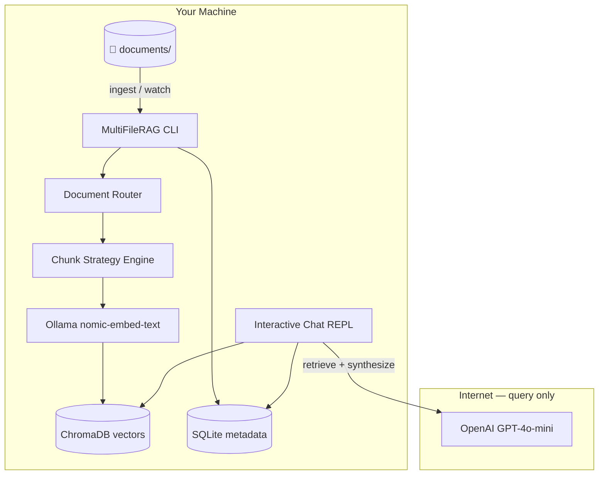

# MultiFileRAG CLI — Local RAG Implementation Plan

> **For agentic workers:** Implement phases in order. Each phase should be runnable and testable before moving on.  
> **Audience:** Side-project owner (non-developer friendly overview in §1–2; technical detail from §3 onward).

| Field | Value |
|-------|-------|
| **Document Version** | 1.0 |
| **Status** | Ready for implementation |
| **Last Updated** | 2026-06-13 |
| **Replaces** | Web SaaS path (Phase 2–4 of original plan) for local development |
| **Related** | [PRD](../PRD.md) §9 file types, [Technical Plan](../TECHNICAL_PLAN.md) RAG params |

---

## 1. What You Are Building (Plain Language)

MultiFileRAG CLI is a **local command-line RAG agent** that:

1. **Watches a folder** (or ingests it once) containing your documents, spreadsheets, and code files.
2. **Extracts text** from each supported file type.
3. **Chooses a smart chunking strategy** based on what kind of document it is (code vs PDF vs spreadsheet vs markdown).
4. **Embeds chunks locally** using Ollama — nothing leaves your machine during ingestion.
5. **Stores vectors locally** in a database on disk.
6. **Lets you chat in the terminal** — ask questions, follow up, get answers grounded in your files.
7. **Uses OpenAI GPT-4o-mini only at query time** to rewrite retrieved chunks into a clear, structured answer (with citations).

There is **no browser, no OAuth, no cloud hosting**. Everything runs on your laptop inside Docker (recommended) or directly with Python + Ollama installed.

---

## 2. Architecture Overview

### 2.1 What runs where

| Component | Runs | Needs internet? |
|-----------|------|-----------------|
| File watcher / ingest | Local (CLI) | No |
| Text extraction | Local (CLI) | No |
| Chunking + routing | Local (CLI) | No |
| Embeddings (Ollama) | Local (Ollama daemon) | No (after model download) |
| Vector search | Local (ChromaDB) | No |
| Answer synthesis | OpenAI API | **Yes** — only when you ask a question |
| Conversation history | Local (SQLite) | No |

### 2.2 System diagram



### 2.3 Design principles

1. **Document-aware chunking** — A Python file is split by functions/classes; a PDF by paragraphs/pages; a spreadsheet by sheet + row groups; markdown by headings.
2. **Decision router** — Rule-based classifier picks the chunk profile (no LLM cost during ingestion).
3. **Reproducible** — Docker Compose bundles Ollama + Chroma + CLI with pinned versions.
4. **Incremental ingest** — Re-ingest only changed files (hash-based dedup).
5. **Grounded answers** — GPT-4o-mini receives retrieved chunks + strict system prompt; must say "not found" when context is insufficient.

---

## 3. Approved Technical Decisions

| ID | Decision | Value | Rationale |
|----|----------|-------|-----------|
| L-01 | Language | **Python 3.12** | Best ecosystem for document parsing; matches existing `apps/api` libs |
| L-02 | CLI framework | **Typer + Rich** | Simple commands, colored output, progress bars |
| L-03 | REPL | **prompt_toolkit** | Multi-turn history, line editing, `/commands` |
| L-04 | Embeddings | **Ollama `nomic-embed-text`** | Strong local embeddings; 768 dims; free |
| L-05 | Vector store | **ChromaDB** (persistent) | Simple local storage; good Docker support |
| L-06 | Metadata DB | **SQLite** | File registry, chunk metadata, conversations |
| L-07 | Query LLM | **OpenAI GPT-4o-mini** | Answer synthesis only; streaming optional v1 |
| L-08 | File types | **PRD §9** (reuse `packages/shared/supported_extensions.json`) | Same allowlist as original project |
| L-09 | Chunk defaults | 800 tokens / 100 overlap (prose); overridden per strategy | Aligns with approved Technical Plan |
| L-10 | Retrieval | Top-k = 10, cosine similarity | Same as Technical Plan |
| L-11 | Citations | File name + ~200 char excerpt | On by default in REPL; `/citations off` toggle |
| L-12 | Storage limits | **None locally** (remove 100 MB / 15 MB caps) | Local side project; disk is user's constraint |
| L-13 | Project location | **`apps/cli/`** in this monorepo | Reuse shared extension list; web app left untouched |

### 3.1 Explicitly out of scope (v1 CLI)

- Web UI, OAuth, cloud deploy (Vercel/Render/Neon/R2)
- OpenAI embeddings (local Ollama only)
- Image / presentation files
- Multi-user / auth
- Fine-tuning models
- LLM-based chunk routing during ingest (keep ingest 100% local + deterministic)

---

## 4. Repository Layout (Target)

```
MultiFileRAG/
├── apps/
│   ├── cli/                              # NEW — this plan
│   │   ├── multifilerag/
│   │   │   ├── __init__.py
│   │   │   ├── __main__.py               # python -m multifilerag
│   │   │   ├── cli.py                    # Typer app entry
│   │   │   ├── config.py                 # Settings from env + config file
│   │   │   ├── constants.py              # Reads packages/shared JSON
│   │   │   ├── extractors/               # One module per file category
│   │   │   │   ├── base.py
│   │   │   │   ├── documents.py           # pdf, docx, doc, txt, md, rtf
│   │   │   │   ├── spreadsheets.py        # xlsx, xls, csv, ods
│   │   │   │   └── source_code.py         # all code extensions
│   │   │   ├── chunking/
│   │   │   │   ├── base.py               # Chunk, ChunkProfile dataclasses
│   │   │   │   ├── router.py             # Document type → strategy
│   │   │   │   ├── prose.py              # Recursive split, PDF paragraphs
│   │   │   │   ├── markdown.py           # Header-aware splitting
│   │   │   │   ├── code.py               # Function/class boundaries
│   │   │   │   ├── spreadsheet.py        # Sheet + row-group chunks
│   │   │   │   └── structured.py         # JSON/YAML/TOML key paths
│   │   │   ├── embedding/
│   │   │   │   └── ollama.py             # Batch embed via Ollama HTTP API
│   │   │   ├── storage/
│   │   │   │   ├── chroma_store.py       # Vector CRUD + search
│   │   │   │   └── sqlite_store.py       # Files, chunks, conversations
│   │   │   ├── pipeline/
│   │   │   │   ├── ingest.py             # Full file → chunks → embed → store
│   │   │   │   └── watcher.py            # watchdog-based directory monitor
│   │   │   ├── rag/
│   │   │   │   ├── retriever.py          # Scoped vector search
│   │   │   │   ├── prompts.py            # System + user prompt templates
│   │   │   │   └── synthesizer.py        # OpenAI GPT-4o-mini calls
│   │   │   └── repl/
│   │   │       ├── session.py            # Conversation state
│   │   │       └── commands.py           # /help, /files, /scope, /exit
│   │   ├── tests/
│   │   ├── pyproject.toml
│   │   ├── Dockerfile
│   │   └── README.md
│   └── web/                              # Existing — not modified by this plan
│   └── api/                              # Existing — not modified by this plan
├── docker/
│   ├── docker-compose.yml                # Existing Postgres/MinIO (web dev)
│   └── docker-compose.cli.yml            # NEW — Ollama + Chroma + CLI
├── packages/shared/
│   └── supported_extensions.json         # Reused
└── docs/plans/
    └── cli-local-rag-implementation-plan.md  # This file
```

---

## 5. Document Router & Chunking Strategies

The **router** is the "decision skill" — it inspects each file and selects a chunk profile without calling any LLM.

### 5.1 Routing table

| Category | Extensions | Strategy | Chunk unit | Overlap / notes |
|----------|------------|----------|------------|-----------------|
| Markdown | `.md` | `markdown_headers` | Split on `#` hierarchy; min 200 tokens per chunk | Include heading breadcrumb in metadata |
| Plain text | `.txt`, `.rtf` | `prose_recursive` | 800 tokens, 100 overlap | Sentence-boundary aware |
| PDF | `.pdf` | `prose_pages` | Paragraph groups ~800 tokens | Store `page_number` in metadata |
| Word | `.docx`, `.doc` | `prose_recursive` | 800 tokens, 100 overlap | Preserve heading style if detectable |
| Spreadsheet | `.xlsx`, `.xls`, `.ods` | `sheet_rows` | Header row + 50 data rows per chunk | **All sheets** indexed; `sheet_name` in metadata |
| CSV | `.csv` | `sheet_rows` | Header + 50 rows | Single "sheet" |
| Source code | `.py`, `.js`, `.ts`, … | `code_ast` | Function/class blocks; fallback line windows 120 lines | Include `symbol_name`, `language` |
| Structured data | `.json`, `.yaml`, `.yml`, `.toml` | `structured_keys` | Top-level keys or array slices ~800 tokens | Preserve JSON path in metadata |
| Web markup | `.html`, `.xml`, `.css` | `prose_recursive` | Tag-aware paragraph split | Strip scripts/styles from HTML |
| SQL | `.sql` | `code_statement` | Split on `;` + CREATE/ALTER blocks | Statement type in metadata |

### 5.2 Router algorithm

```python
# apps/cli/multifilerag/chunking/router.py (reference implementation)

def route_document(file_path: Path, extracted_text: ExtractedDocument) -> ChunkProfile:
    ext = file_path.suffix.lstrip(".").lower()
    category = classify_extension(ext)          # documents | spreadsheets | source_code
    if ext == "md":
        return ChunkProfile(strategy="markdown_headers", ...)
    if ext in SPREADSHEET_EXTS:
        return ChunkProfile(strategy="sheet_rows", rows_per_chunk=50, ...)
    if ext in STRUCTURED_EXTS:
        return ChunkProfile(strategy="structured_keys", ...)
    if ext in CODE_EXTS:
        return ChunkProfile(strategy="code_ast", language=ext_to_language(ext), ...)
    if ext == "pdf":
        return ChunkProfile(strategy="prose_pages", ...)
    return ChunkProfile(strategy="prose_recursive", chunk_size=800, overlap=100, ...)
```

### 5.3 Chunk metadata (stored with every vector)

Every chunk carries metadata used for filtering and citations:

```json
{
  "file_id": "uuid",
  "file_path": "relative/path/to/file.pdf",
  "file_name": "file.pdf",
  "chunk_index": 3,
  "strategy": "prose_pages",
  "page_number": 12,
  "sheet_name": null,
  "symbol_name": null,
  "heading_trail": "Chapter 2 > Section 1",
  "token_count": 742,
  "content_hash": "sha256..."
}
```

---

## 6. CLI Command Reference

Install entry point: `multifilerag` (via `pip install -e apps/cli`).

| Command | Description |
|---------|-------------|
| `multifilerag init` | Create `~/.multifilerag/` data dir, default config, verify Ollama |
| `multifilerag ingest <path>` | One-time scan: extract → chunk → embed → store |
| `multifilerag watch <path>` | Watch directory; auto-ingest on create/modify/delete |
| `multifilerag status` | List indexed files, chunk counts, last ingest time, Ollama model status |
| `multifilerag chat` | Start interactive REPL (default: search all ready files) |
| `multifilerag chat --files a.pdf,b.py` | REPL scoped to specific files |
| `multifilerag reset` | Wipe vector + metadata store (with confirmation) |
| `multifilerag pull-models` | Run `ollama pull nomic-embed-text` helper |

### 6.1 REPL commands (inside `chat`)

| Command | Action |
|---------|--------|
| `/help` | Show available commands |
| `/files` | List indexed files and status |
| `/scope` | Show or set file scope for queries |
| `/scope all` | Search all files (default) |
| `/scope file1.pdf,file2.py` | Limit retrieval |
| `/citations on\|off` | Toggle citation append |
| `/history` | Show conversation turns |
| `/clear` | Clear conversation (keeps index) |
| `/exit` or Ctrl+D | Quit REPL |

### 6.2 Example session

```bash
# First-time setup
docker compose -f docker/docker-compose.cli.yml up -d
multifilerag init
multifilerag pull-models
multifilerag ingest ./my-documents

# Chat
multifilerag chat
> What does the onboarding doc say about storage limits?
[Answer based on your files...]

> /scope policies.pdf
> Summarize the refund policy
[Answer scoped to policies.pdf...]

> /exit
```

---

## 7. Data Layout on Disk

Default data directory: `~/.multifilerag/` (override with `MULTIFILERAG_DATA_DIR`).

```
~/.multifilerag/
├── config.toml              # Paths, models, retrieval params
├── metadata.db              # SQLite — files, chunks, conversations
├── chroma/                  # ChromaDB persistent storage
└── logs/
    └── ingest.log
```

User documents are **never copied** — only read from the path you provide. The index stores extracted text hashes to detect changes.

---

## 8. Environment Variables

| Variable | Required | Default | Purpose |
|----------|----------|---------|---------|
| `OPENAI_API_KEY` | For `chat` only | — | GPT-4o-mini synthesis |
| `OLLAMA_HOST` | No | `http://localhost:11434` | Ollama API |
| `OLLAMA_EMBED_MODEL` | No | `nomic-embed-text` | Embedding model name |
| `MULTIFILERAG_DATA_DIR` | No | `~/.multifilerag` | Persistent data |
| `OPENAI_MODEL` | No | `gpt-4o-mini` | Synthesis model |
| `RAG_TOP_K` | No | `10` | Chunks retrieved per query |
| `RAG_TEMPERATURE` | No | `0.1` | LLM temperature |

`.env.example` additions at repo root:

```bash
# CLI RAG (apps/cli)
OPENAI_API_KEY=sk-...
OLLAMA_HOST=http://localhost:11434
OLLAMA_EMBED_MODEL=nomic-embed-text
MULTIFILERAG_DATA_DIR=~/.multifilerag
```

---

## 9. Docker Compose (CLI Stack)

File: `docker/docker-compose.cli.yml`

```yaml
services:
  ollama:
    image: ollama/ollama:latest
    ports:
      - "11434:11434"
    volumes:
      - ollama_data:/root/.ollama
    # GPU optional — comment in deploy.resources for NVIDIA

  chroma:
    image: chromadb/chroma:0.5.23
    ports:
      - "8000:8000"
    volumes:
      - chroma_data:/chroma/chroma
    environment:
      - IS_PERSISTENT=TRUE

  cli:
    build:
      context: ..
      dockerfile: apps/cli/Dockerfile
    depends_on:
      - ollama
      - chroma
    environment:
      - OLLAMA_HOST=http://ollama:11434
      - CHROMA_HOST=http://chroma:8000
      - OPENAI_API_KEY=${OPENAI_API_KEY}
      - MULTIFILERAG_DATA_DIR=/data
    volumes:
      - ${DOCUMENTS_DIR:-./documents}:/documents:ro
      - cli_data:/data
    stdin_open: true
    tty: true
    entrypoint: ["multifilerag"]

volumes:
  ollama_data:
  chroma_data:
  cli_data:
```

**First run:**

```bash
docker compose -f docker/docker-compose.cli.yml run --rm cli pull-models
docker compose -f docker/docker-compose.cli.yml run --rm cli ingest /documents
docker compose -f docker/docker-compose.cli.yml run --rm cli chat
```

---

## 10. RAG Query Pipeline

### 10.1 Retrieval (local)

1. Embed user question via Ollama (`nomic-embed-text`).
2. ChromaDB cosine search, top-k=10.
3. Optional metadata filter by file scope (REPL `/scope`).
4. Deduplicate overlapping chunks from same file.

### 10.2 Synthesis (OpenAI — query time only)

System prompt (strict grounding):

```
You are a document assistant. Answer ONLY using the provided context chunks.
If the context does not contain enough information, say clearly:
"I could not find this in your documents."
Do not guess or use outside knowledge.
When citing, refer to file names from chunk metadata.
Structure answers clearly with short paragraphs or bullet points when helpful.
```

User message includes:

- Original question
- Conversation history (last N turns from SQLite)
- Retrieved chunks with `[file: ..., excerpt: ...]` headers

### 10.3 Response format

```
Based on your documents:

[Structured answer paragraphs...]

Sources:
- onboarding.md — "...excerpt up to 200 chars..."
- config.py — "...excerpt..."
```

When `/citations off`, omit the Sources block.

---

## 11. Implementation Phases

### Phase 0 — Prerequisites (human, one time)

| Step | Action |
|------|--------|
| 1 | Install [Docker Desktop](https://www.docker.com/products/docker-desktop/) |
| 2 | Get [OpenAI API key](https://platform.openai.com/api-keys); set billing limit ($5) |
| 3 | Clone repo; copy `.env.example` → `.env` and set `OPENAI_API_KEY` |
| 4 | Create a test folder `./documents/` with sample PDF, `.md`, `.py`, `.csv` |

**Verify:** `docker --version` works; `OPENAI_API_KEY` set.

---

### Phase 1 — CLI scaffold & config

**Goal:** Empty CLI runs; config and data dirs created.

**Files:**
- Create: `apps/cli/pyproject.toml`, `apps/cli/multifilerag/cli.py`, `config.py`, `constants.py`
- Create: `apps/cli/multifilerag/__main__.py`

**Tasks:**
- [ ] Initialize `apps/cli` with `pyproject.toml` (Typer, Rich, pydantic-settings, httpx, chromadb, sqlalchemy)
- [ ] Typer app with stub commands: `init`, `ingest`, `watch`, `status`, `chat`, `reset`, `pull-models`
- [ ] `config.py`: load from env + `~/.multifilerag/config.toml`
- [ ] `constants.py`: read `packages/shared/supported_extensions.json` (same path pattern as `apps/api`)
- [ ] `init` command: create data dirs, write default config, ping Ollama `/api/tags`
- [ ] Root `Makefile` target: `make cli-install`, `make cli-test`

**Verify:**
```bash
cd apps/cli && pip install -e ".[dev]"
multifilerag init
# Expected: "Data directory ready" + Ollama reachable (or clear error)
pytest apps/cli/tests/test_config.py -v
```

---

### Phase 2 — Text extraction

**Goal:** Any supported file → structured `ExtractedDocument`.

**Files:**
- Create: `apps/cli/multifilerag/extractors/base.py`, `documents.py`, `spreadsheets.py`, `source_code.py`
- Create: `apps/cli/tests/fixtures/` (sample files)
- Create: `apps/cli/tests/test_extractors.py`

**Dependencies:** `pypdf`, `python-docx`, `openpyxl`, `xlrd`, `odfpy`, `striprtf`, `chardet`

**Tasks:**
- [ ] `ExtractedDocument` dataclass: `text`, `pages[]`, `sheets[]`, `language`, `metadata`
- [ ] PDF extractor with page boundaries
- [ ] DOCX/DOC/RTF/TXT/MD extractors
- [ ] Spreadsheet extractor: **all sheets**, header detection, row iteration
- [ ] Source code: read as UTF-8 with chardet fallback; no transformation
- [ ] Reject unsupported extensions with message listing supported types (PRD FR-UP-06 behavior)
- [ ] Unit tests per extractor using small fixtures

**Verify:**
```bash
pytest apps/cli/tests/test_extractors.py -v
python -c "from multifilerag.extractors.documents import extract; print(extract('tests/fixtures/sample.pdf'))"
```

---

### Phase 3 — Chunking router & strategies

**Goal:** Extracted document → list of `Chunk` objects with rich metadata.

**Files:**
- Create: `apps/cli/multifilerag/chunking/` (all modules from §4)
- Create: `apps/cli/tests/test_chunking.py`

**Tasks:**
- [ ] `Chunk` and `ChunkProfile` dataclasses in `base.py`
- [ ] `router.py` — routing table from §5.1
- [ ] `markdown.py` — split on `#`, `#`, `###` with breadcrumb metadata
- [ ] `prose.py` — tiktoken-based 800/100 recursive split
- [ ] `code.py` — Python: `ast` walk; JS/TS: regex function boundaries; fallback sliding window
- [ ] `spreadsheet.py` — 50-row chunks per sheet with header row repeated in chunk text
- [ ] `structured.py` — JSON/YAML/TOML path-based chunks
- [ ] Tests: same input → deterministic chunk count; metadata fields populated

**Verify:**
```bash
pytest apps/cli/tests/test_chunking.py -v
# Manual: chunk a 500-line .py file → chunks align to def/class lines
```

---

### Phase 4 — Local storage (SQLite + ChromaDB)

**Goal:** Persist files, chunks, and vectors locally.

**Files:**
- Create: `apps/cli/multifilerag/storage/sqlite_store.py`, `chroma_store.py`
- Create: `apps/cli/tests/test_storage.py`

**SQLite schema:**

```sql
-- files
CREATE TABLE files (
  id TEXT PRIMARY KEY,
  path TEXT NOT NULL UNIQUE,
  file_name TEXT NOT NULL,
  extension TEXT NOT NULL,
  size_bytes INTEGER NOT NULL,
  content_hash TEXT NOT NULL,
  status TEXT NOT NULL,  -- processing | ready | failed
  error_message TEXT,
  chunk_count INTEGER DEFAULT 0,
  ingested_at TEXT,
  updated_at TEXT
);

-- chunks (metadata mirror; vectors in Chroma)
CREATE TABLE chunks (
  id TEXT PRIMARY KEY,
  file_id TEXT NOT NULL REFERENCES files(id) ON DELETE CASCADE,
  chunk_index INTEGER NOT NULL,
  token_count INTEGER,
  metadata_json TEXT NOT NULL
);

-- conversations (REPL)
CREATE TABLE conversations (
  id TEXT PRIMARY KEY,
  title TEXT,
  created_at TEXT
);

CREATE TABLE messages (
  id TEXT PRIMARY KEY,
  conversation_id TEXT NOT NULL REFERENCES conversations(id) ON DELETE CASCADE,
  role TEXT NOT NULL,
  content TEXT NOT NULL,
  created_at TEXT
);
```

**Tasks:**
- [ ] SQLAlchemy models + Alembic optional (raw SQL init acceptable for v1)
- [ ] Chroma collection `multifilerag_chunks` with metadata filters
- [ ] Upsert file by path; skip if `content_hash` unchanged
- [ ] Delete vectors when file removed or hash changed
- [ ] `status` command reads from SQLite

**Verify:**
```bash
pytest apps/cli/tests/test_storage.py -v
```

---

### Phase 5 — Ollama embeddings

**Goal:** Batch-embed chunks via local Ollama.

**Files:**
- Create: `apps/cli/multifilerag/embedding/ollama.py`
- Create: `apps/cli/tests/test_embedding.py` (mock HTTP)

**Tasks:**
- [ ] `embed_texts(texts: list[str]) -> list[list[float]]` via `POST /api/embeddings`
- [ ] Batch size 32 with progress bar (Rich)
- [ ] Retry on Ollama unavailable with clear message
- [ ] `pull-models` command wraps `ollama pull nomic-embed-text`
- [ ] Store vectors in Chroma with chunk id = Chroma document id

**Verify:**
```bash
ollama pull nomic-embed-text
pytest apps/cli/tests/test_embedding.py -v
# Integration (requires Ollama running):
python -c "from multifilerag.embedding.ollama import embed_texts; print(len(embed_texts(['hello'])[0]))"
# Expected: 768
```

---

### Phase 6 — Ingestion pipeline

**Goal:** End-to-end `multifilerag ingest ./documents`.

**Files:**
- Create: `apps/cli/multifilerag/pipeline/ingest.py`
- Modify: `apps/cli/multifilerag/cli.py` (wire ingest command)

**Pipeline steps per file:**

```
discover → validate extension → hash check → extract → route → chunk
  → embed (Ollama) → store (Chroma + SQLite) → mark ready
```

**Tasks:**
- [ ] Recursive directory walk; skip hidden files and `.git/`
- [ ] Parallel extraction (ThreadPoolExecutor, max 4 workers)
- [ ] Sequential embed batches (Ollama memory)
- [ ] Per-file error handling: mark `failed` + `error_message`; continue others
- [ ] Summary table at end: ready / failed / skipped (unchanged)
- [ ] `--force` flag to re-ingest even if hash matches

**Verify:**
```bash
multifilerag ingest ./documents
multifilerag status
# Expected: all sample files "ready" with chunk counts
```

---

### Phase 7 — RAG retrieval + OpenAI synthesis

**Goal:** Query pipeline works outside REPL (testable).

**Files:**
- Create: `apps/cli/multifilerag/rag/retriever.py`, `prompts.py`, `synthesizer.py`
- Create: `apps/cli/tests/test_rag.py` (mock OpenAI)

**Tasks:**
- [ ] `retriever.search(query, file_ids=None, top_k=10)` → ranked chunks
- [ ] `synthesizer.answer(query, chunks, history)` → GPT-4o-mini completion
- [ ] Strict not-found path when zero chunks or low similarity (threshold 0.3 — tunable)
- [ ] Format citations per Technical Plan (200 char excerpt)
- [ ] Unit tests with mocked OpenAI and fixed embeddings

**Verify:**
```bash
pytest apps/cli/tests/test_rag.py -v
OPENAI_API_KEY=... python -c "
from multifilerag.rag.retriever import search
from multifilerag.rag.synthesizer import answer
chunks = search('storage limit')
print(answer('What is the storage limit?', chunks, []))
"
```

---

### Phase 8 — Interactive REPL

**Goal:** `multifilerag chat` — multi-turn grounded Q&A.

**Files:**
- Create: `apps/cli/multifilerag/repl/session.py`, `commands.py`
- Modify: `apps/cli/multifilerag/cli.py`

**Tasks:**
- [ ] prompt_toolkit REPL with history persisted to `~/.multifilerag/repl_history`
- [ ] Slash commands from §6.1
- [ ] Auto-create conversation in SQLite; title = first question truncated to 40 chars
- [ ] Multi-turn: pass last 6 messages as history to synthesizer
- [ ] Rich markdown rendering for answers
- [ ] Handle "no ready files" gracefully (FR-QA-10 behavior)

**Verify:**
```bash
multifilerag chat
> What files are indexed?
> [ask about content of a known fixture file]
> /scope wrong.pdf
> [verify scoped behavior]
> /exit
```

---

### Phase 9 — Watch mode

**Goal:** `multifilerag watch ./documents` auto-reindexes on changes.

**Files:**
- Create: `apps/cli/multifilerag/pipeline/watcher.py`

**Dependencies:** `watchdog`

**Tasks:**
- [ ] Debounce file events (2 seconds)
- [ ] On create/modify: run single-file ingest pipeline
- [ ] On delete: remove from SQLite + Chroma
- [ ] Graceful shutdown on Ctrl+C
- [ ] Log events to `~/.multifilerag/logs/ingest.log`

**Verify:**
```bash
multifilerag watch ./documents &
echo "new content" >> ./documents/notes.txt
sleep 5
multifilerag status  # notes.txt re-indexed
```

---

### Phase 10 — Docker packaging

**Goal:** One-command reproducible local stack.

**Files:**
- Create: `apps/cli/Dockerfile`
- Create: `docker/docker-compose.cli.yml`
- Update: root `README.md` (CLI section)
- Update: `.env.example`

**Tasks:**
- [ ] Multi-stage Dockerfile: Python 3.12 slim, install `apps/cli`
- [ ] Compose services: ollama, chroma, cli (see §9)
- [ ] Document `DOCUMENTS_DIR` volume mount
- [ ] Healthcheck: `multifilerag status` exits 0 when Ollama + Chroma up
- [ ] README quickstart for non-developers (copy-paste commands)

**Verify:**
```bash
docker compose -f docker/docker-compose.cli.yml up -d
docker compose -f docker/docker-compose.cli.yml run --rm cli pull-models
docker compose -f docker/docker-compose.cli.yml run --rm cli ingest /documents
docker compose -f docker/docker-compose.cli.yml run --rm cli chat
```

---

### Phase 11 — Tests, polish, exit criteria

**Tasks:**
- [ ] Integration test: ingest fixtures → query → assert answer contains known string
- [ ] Error messages plain English (no stack traces to user unless `--verbose`)
- [ ] `multifilerag reset` with typed confirmation `yes`
- [ ] Logging levels: `--verbose` flag on all commands

**Exit criteria (definition of done):**

- [ ] `docker compose -f docker/docker-compose.cli.yml up` starts full stack
- [ ] Ingest processes all PRD §9 file types in `./documents`
- [ ] Chunking strategy differs by file type (verify via `status --verbose`)
- [ ] Embeddings run via Ollama only — no OpenAI calls during ingest
- [ ] `multifilerag chat` supports multi-turn REPL with `/scope`, `/citations`, `/exit`
- [ ] Answers cite file name + excerpt; not-found when content missing
- [ ] Watch mode re-indexes changed files within debounce window
- [ ] OpenAI called **only** during `chat` queries
- [ ] `pytest apps/cli/tests/ -v` passes

---

## 12. Python Dependencies (`apps/cli/pyproject.toml`)

```toml
[project]
name = "multifilerag-cli"
version = "0.1.0"
requires-python = ">=3.12"
dependencies = [
  "typer[all]>=0.12",
  "rich>=13.7",
  "pydantic-settings>=2.2",
  "httpx>=0.27",
  "chromadb>=0.5",
  "sqlalchemy>=2.0",
  "tiktoken>=0.7",
  "pypdf>=4.0",
  "python-docx>=1.1",
  "openpyxl>=3.1",
  "xlrd>=2.0",
  "odfpy>=1.4",
  "striprtf>=0.0.26",
  "chardet>=5.2",
  "pyyaml>=6.0",
  "tomli>=2.0; python_version<'3.11'",
  "watchdog>=4.0",
  "prompt-toolkit>=3.0",
  "openai>=1.30",
]

[project.optional-dependencies]
dev = ["pytest>=8.0", "pytest-asyncio>=0.23", "ruff>=0.4"]

[project.scripts]
multifilerag = "multifilerag.cli:app"
```

---

## 13. Testing Strategy

| Layer | Tool | What to test |
|-------|------|--------------|
| Extractors | pytest + fixtures | PDF pages, multi-sheet xlsx, encoding edge cases |
| Chunking | pytest | Deterministic splits, metadata, router picks |
| Storage | pytest + temp dir | Hash dedup, delete cascades |
| Embedding | pytest + httpx mock | Batch logic, retry |
| RAG | pytest + mock OpenAI | Grounding prompt, not-found path |
| E2E | pytest + Docker mark | Full ingest → query (optional CI job) |

Run all CLI tests:

```bash
cd apps/cli && pytest tests/ -v
```

---

## 14. Risks & Mitigations

| Risk | Impact | Mitigation |
|------|--------|------------|
| Ollama not running | Ingest fails | `init` checks; clear error + `pull-models` helper |
| Large PDFs slow to parse | Long ingest | Progress bar; per-file timeout (5 min) |
| Code AST chunking fails on syntax errors | Partial index | Fallback to line-window chunker |
| Ollama embedding quality vs OpenAI | Lower retrieval accuracy | Tune top-k; hybrid keyword fallback (Phase 11+ optional) |
| OpenAI costs | Small per query | gpt-4o-mini; billing limit; local retrieval reduces tokens |
| Docker memory (Ollama) | OOM on small machines | Document 8 GB RAM minimum; reduce embed batch size |

---

## 15. Future Enhancements (Post-v1)

Not in scope now; architecture supports adding later:

- Hybrid search (BM25 + vector) for better code retrieval
- `ollama` local LLM for synthesis (zero cloud)
- Export/import index bundle
- MCP server wrapper for Cursor integration
- Reuse `apps/api` parsing code via shared Python package

---

## 16. Relationship to Existing Web App

The Phase 1 web app (`apps/web`, `apps/api`) remains in the repo but is **not required** for the CLI path. Shared asset:

- `packages/shared/supported_extensions.json` — single file type allowlist

You may archive or ignore the web app while building the CLI. No OAuth, R2, Neon, or Vercel setup needed for this plan.

---

## 17. Revision History

| Version | Date | Changes |
|---------|------|---------|
| 1.0 | 2026-06-13 | Initial CLI local RAG plan — Ollama embeddings, GPT-4o-mini query only, Docker, REPL, watch mode |
